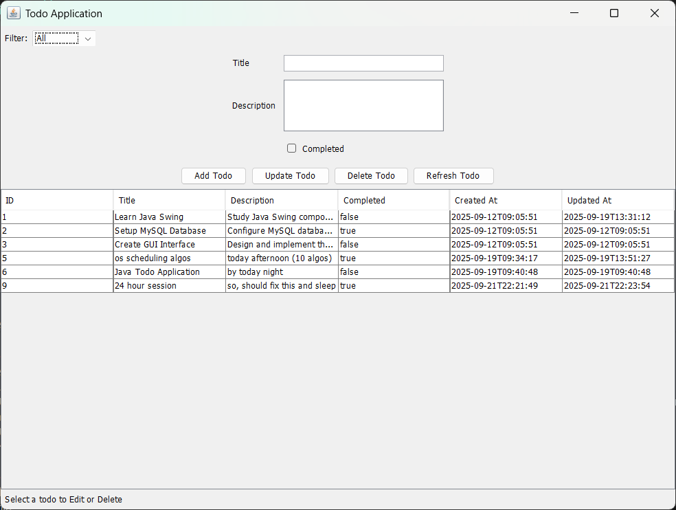

# Todo Application

A desktop Todo application built with Java Swing and MySQL database for managing your daily tasks efficiently.



## Features

- **Add Todos**: Create new tasks with title and description
- **Update Todos**: Edit existing tasks
- **Delete Todos**: Remove completed or unwanted tasks
- **Mark as Completed**: Track task completion status
- **Filter Tasks**: View all tasks or filter by completion status
- **Persistent Storage**: All tasks are stored in MySQL database
- **Timestamps**: Automatic tracking of creation and update times

## Technology Stack

- **Java 11**: Core programming language
- **Java Swing**: GUI framework for desktop interface
- **MySQL 8.0**: Database for persistent storage
- **Maven**: Build and dependency management
- **JDBC**: Database connectivity

## Project Structure

```
todo-application/
├── src/main/java/com/todo/
│   ├── Main.java                    # Application entry point
│   ├── dao/
│   │   └── TodoAppDAO.java          # Data Access Object for database operations
│   ├── gui/
│   │   └── TodoAppGUI.java          # Swing GUI implementation
│   ├── model/
│   │   └── Todo.java                # Todo entity model
│   └── util/
│       └── DatabaseConnection.java  # Database connection utility
├── pom.xml                          # Maven configuration
└── README.md
```

## Prerequisites

- Java Development Kit (JDK) 11 or higher
- MySQL Server 8.0 or higher
- Maven 3.6 or higher

## Database Setup

1. Install and start MySQL Server
2. Create a database for the application:
```sql
CREATE DATABASE todo_db;
USE todo_db;

CREATE TABLE todos (
    id INT AUTO_INCREMENT PRIMARY KEY,
    title VARCHAR(255) NOT NULL,
    description TEXT,
    completed BOOLEAN DEFAULT FALSE,
    created_at TIMESTAMP DEFAULT CURRENT_TIMESTAMP,
    updated_at TIMESTAMP DEFAULT CURRENT_TIMESTAMP ON UPDATE CURRENT_TIMESTAMP
);
```

3. Update database credentials in `src/main/java/com/todo/util/DatabaseConnection.java`

## Installation & Running

1. Clone the repository:
```bash
git clone <repository-url>
cd todo-application
```

2. Build the project:
```bash
mvn clean install
```

3. Run the application:
```bash
mvn exec:java
```

Or run the packaged JAR:
```bash
java -jar target/todo-application-1.0.0.jar
```

## Usage

1. **Adding a Task**: Enter title and description, then click "Add Todo"
2. **Updating a Task**: Select a task from the table, modify details, and click "Update Todo"
3. **Deleting a Task**: Select a task and click "Delete Todo"
4. **Marking Complete**: Check the "Completed" checkbox before adding or updating
5. **Filtering**: Use the filter dropdown to view all tasks or filter by status
6. **Refreshing**: Click "Refresh Todo" to reload the task list

## Dependencies

- MySQL Connector/J 8.0.33

## License

This project is open source and available for educational purposes.

## Contributing

Feel free to fork this project and submit pull requests for any improvements.
